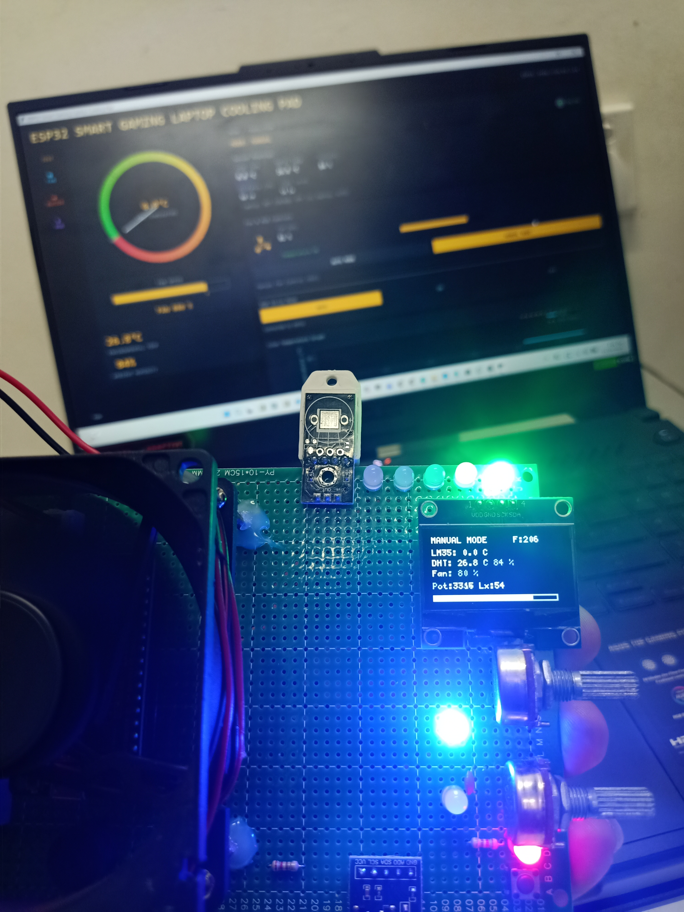
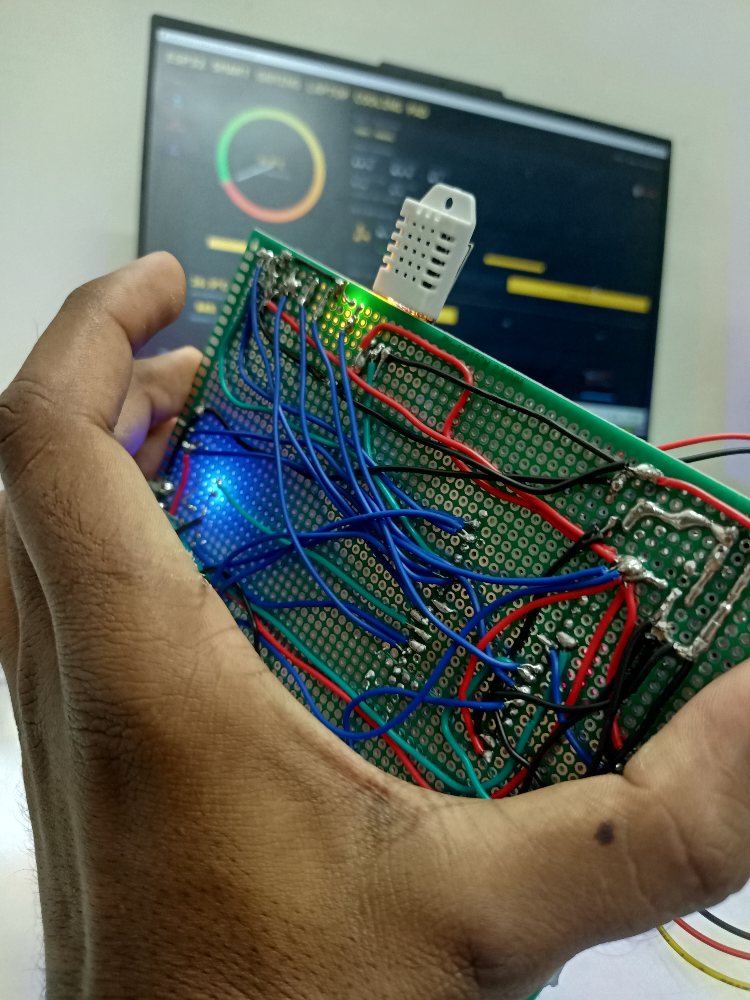
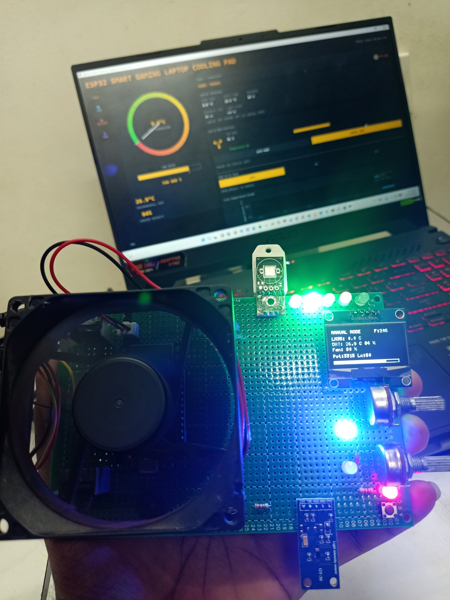
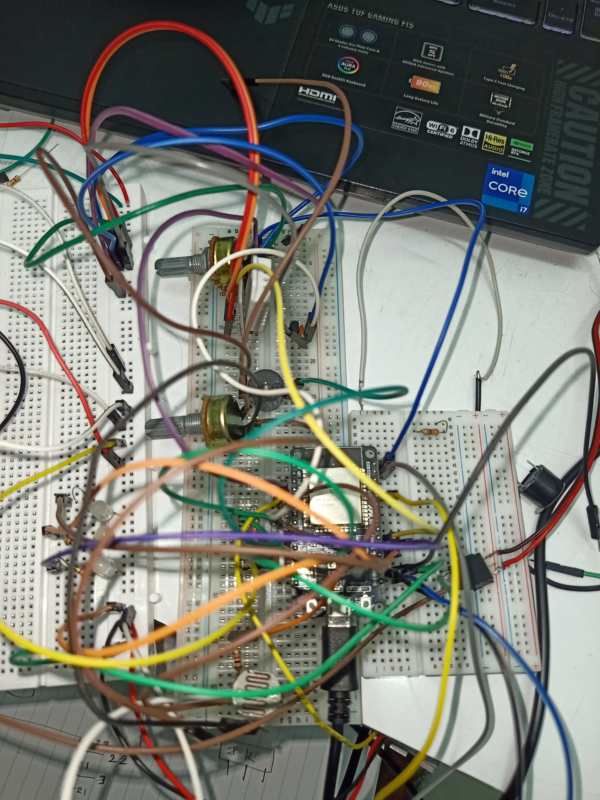
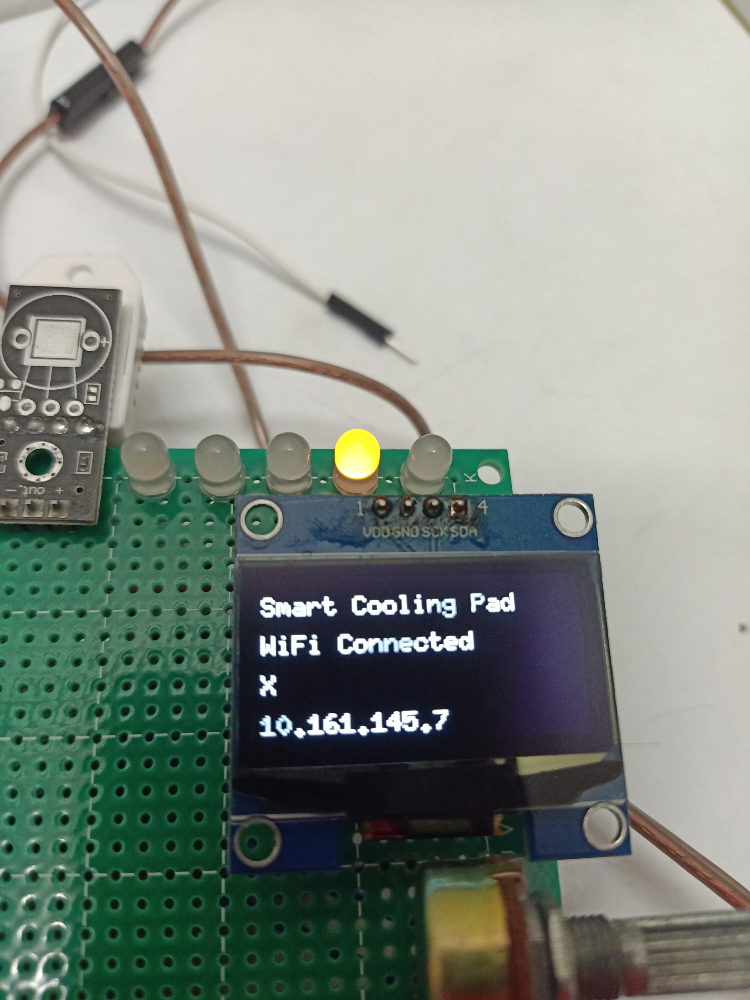

<h1 align="center">ESP32 Smart Power Cooling Pad for Gaming Laptop</h1>

  Wi-Fi Connected • Arduino Firmware • Python Dashboard • Smart Fan Control

  <i>Prototype</i>

  
  

  <i>Front and back view of the cooling pad prototype</i>

  <b>ESP32-based thermal management system with real-time monitoring and control via Python UI.</b>

---

## 🔍 Overview
This project is a **Wi-Fi enabled smart cooling pad** designed for **gaming and high-performance laptops**.
An **ESP32** controls external cooling fans based on real-time temperature readings and communicates
with a **Python-based desktop dashboard** over Wi-Fi for monitoring and control.

The system supports both **automatic temperature-based control** and **manual user control**,
making it suitable for smart thermal management applications.

---

## ✨ Features
- ESP32 firmware developed using Arduino  
- Wi-Fi communication between ESP32 and Python UI  
- Python dashboard for:
  - real-time temperature monitoring  
  - fan ON/OFF status  
  - AUTO / MANUAL mode selection  
- Temperature threshold-based automatic fan control  
- Smart power switching using relay or MOSFET  
- Modular and expandable design  

---

## 🧰 Hardware Components
- ESP32 DevKit  
- DC cooling fans  
- Temperature sensor:
  - DHT11 / DHT22 / DS18B20 / LM35  
- Relay module or MOSFET driver  
- External power supply (5V / 12V based on fans)  
- Cooling pad structure / frame  

---

## 🖥️ Software Stack
### Firmware
- Arduino IDE  
- ESP32 Board Support Package  

### Dashboard
- Python 3.x  
- UI Framework: Tkinter / PyQt  
- Libraries (example):
  - `requests` / `websocket-client`
  - `matplotlib` (optional for plotting)

---

## 🌐 Wi-Fi Communication
The ESP32 communicates with the Python dashboard over Wi-Fi using:
- HTTP REST API (simple and reliable)  
  **or**
- WebSocket (real-time updates)

### Example Functions
- Read temperature & fan status  
- Switch fan ON / OFF remotely  
- Change AUTO / MANUAL mode  
- Update temperature threshold  

---

## ⚙️ System Working
1. ESP32 connects to the local Wi-Fi network  
2. Temperature sensor continuously measures laptop heat  
3. ESP32 compares temperature with preset thresholds  
4. In **AUTO mode**, fans turn ON/OFF automatically  
5. Python UI connects to ESP32 via Wi-Fi  
6. User can monitor data and manually control fans  

---

## 🖼️ Project Images

### 🔹 Device Setup & Python Dashboard

  
  

### 🔹 Breadboard Wiring Check

  

### 🔹 Wi-Fi Connection Status

  

---

## 📂 Repository Structure
